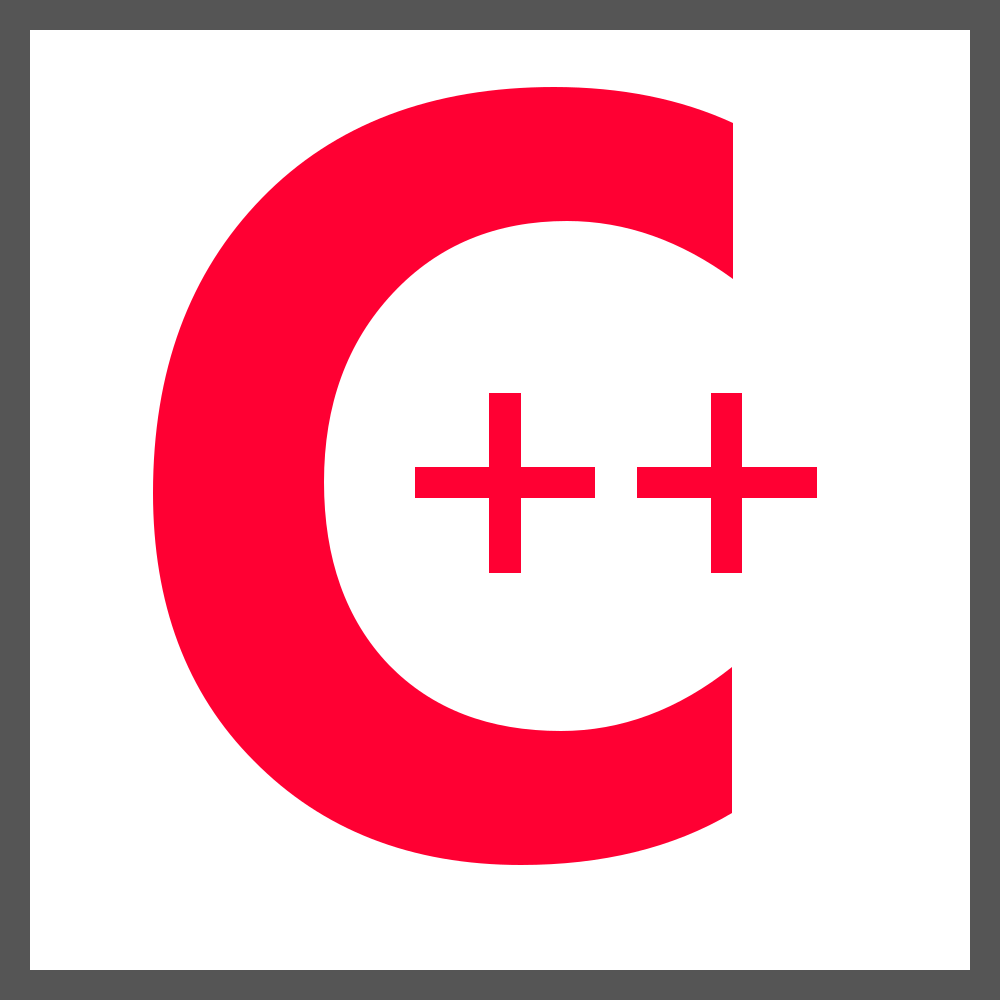
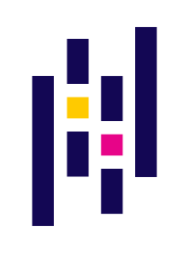

# 👋 Hi, I'm KEQING LI

## 🚀 About Me

  

  <ul>
    <li>UCSD student</li>
    <li>Data science / machine learning enthusiast</li>
    <li>Building projects and learning every day</li>
  </ul>

 

## 🔧 My Skills

<table>
  <tr>
    <td align="center" width="80">
      
    </td>
    <td align="center" width="80">
      
    </td>
    <td align="center" width="80">
      
    </td>
    <td align="center" width="80">
      
    </td>
    <td align="center" width="80">
      
    </td>
    <td align="center" width="80">
      
    </td>
    <td align="center" width="90">
      
    </td>
  </tr>
</table>

